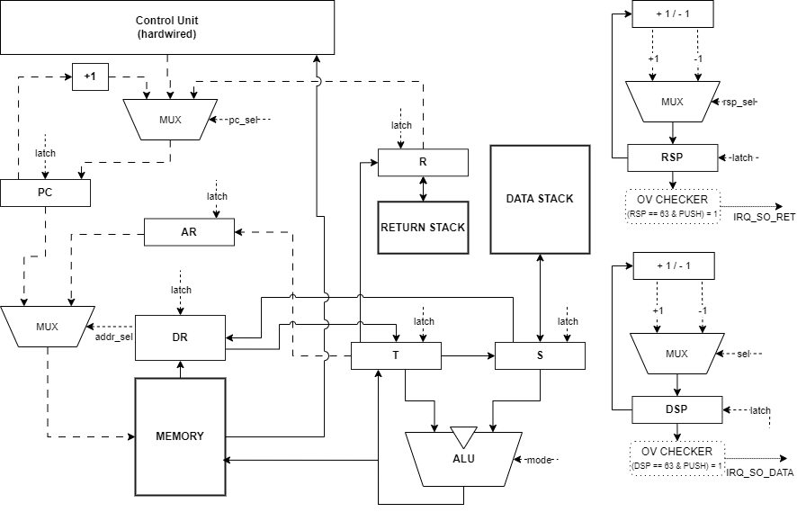
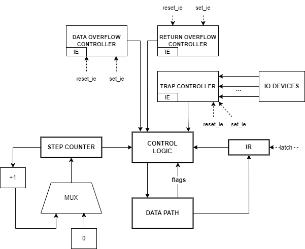

# Лабораторная работа №4. Эксперимент

- **Снагин Станислав Максимович, Р3215**
- `alg | stack | neum | hw | tick | binary | trap | mem | cstr | prob2 | `~~superscalar~~

## Язык программирования (Kronstadt)

Язык Kronstadt - это высокоуровневый императивный язык с синтаксисом, вдохновленным C и JavaScript, адаптированный под стековую архитектуру.

```
program       = { global_decl | func_decl | interrupt_decl }
func_decl     = [ signature ] type id "(" { statement } ")"
signature     = "{" { type id [ "," | ";" ] } "}"
var_decl      = type id "=" expr
type          = "integer" | "long" | "float" | "double" | "boolean" | "char" | "string"
expr          = term { op term }
term          = literal | id | id "&" | call | "(" expr ")"
literal       = int | long ( "<число>L" ) | float ( "<число>f" ) | hex | string | bool
statement     = var_decl | assign | if_stmt | while_stmt | for_stmt | call | "return" [ expr ]
```

### Особенности:


| Категория | Спецификация и особенности реализации | Примеры / Детали |
| :--- | :--- | :--- |
| **Типизация** | Строгая типизация.<br>Поддерживаемые типы: `integer`, `float` (IEEE-754), `boolean`, `char`, `string`. | Строки реализованы как **Null-terminated** и хранятся в статической памяти данных. |
| **Области видимости** | **Глобальная**: переменные объявляются с ключевым словом `global`.<br>**Локальная**: переменные функций (статическая аллокация в памяти данных при компиляции). | Разделение на глобальный контекст и изолированные статические блоки для функций. |
| **Управление памятью** | Прямой доступ к памяти через указатели и оператор разыменования `&`. | `ptr& = val` - запись значения по адресу, хранящемуся в `ptr`. |
| **Функции и прерывания** | Поддержка рекурсии.<br>Передача параметров через стек (stdcall).<br>Специальный тип `interrupt` для обработки событий. | Обработка событий ввода-вывода (`io`) и аппаратных исключений (`so_data`, `so_ret`).<br>Объявление сигнатуры в `{...}`, поддержка рекурсии. |
| **Трансляция выражений** | Сложные математические выражения транслируются в обратную польскую нотацию (RPN) для стековой машины.  | Выражение `result = (a + 5) * b` транслируется в:<br>`PUSH a`, `LOAD`, `PUSH 5`, `ADD`, `PUSH b`, `LOAD`, `MUL`, `PUSH result_addr`, `STORE`. |
| **Управляющие конструкции** | Ветвления `if/elif/else`.<br>Циклы с предусловием `while`.<br>Циклы со счетчиком `for`. | Условия всегда заключаются в фигурные скобки `{}`, а тело конструкций в круглые `()`. |
| **Оптимизация циклов** | Распознавание компилятором паттернов `for {i = x : i < y : i = i + 1}` (вместо 1 - любое целое число). Заменяет медленную проверку условий на `NEXT` через исползования регистра `R` как счетчика.

### Примеры синтаксиса:

Факториал числа / базовые конструкции

```javascript
% Комментарий

{integer n}
integer factorial (
    if {n == 1} (
        return 1
    )
    else (
        return n * factorial(n - 1)
    )
)

integer main (
    print('Result: ')
    print(factorial(5))
)
```

Глобальные переменные

```javascript
global integer my_val = 42
global float pi = 3.14f
global char[100] buffer
```

64-битная арифметика (`long`)

```javascript
integer main (
    long a = 4000000000L     % суффикс L обязателен для констант > 2^24 %
    long b = 1000000000L
    long c = a + b           % честный 64-битный результат: 5000000000 %
    print(c)
)
```

Циклы

```javascript
integer counter = 3
while {counter > 0} (
    print(counter)
    counter = counter - 1
)

for {integer i = 0 : i < 5 : i = i + 1} (
    print(i)
)
```

Прерывания, массивы, строки; запись в строку значений из прерывания

```javascript
global char[100] input_buf
global char* ptr = input_buf
global integer flag = 1

interrupt io (
    char c = read_char()
    if { c == 0 } (
        flag = 0
    ) else (
        ptr& = c           % Сохраняем символ по адресу ptr %
        ptr = ptr + 1      % Сдвигаем указатель %
    )
)
```

Работа с арифметическими операциями (int, float)

```javascript
float x = 10.5f
float y = 2.0f
print(x / y + 1.25f)

integer a = 15
integer b = 4
print(a + b)
print(a - b)
print(a * b)
```

Работа с указателями

```javascript
global integer target = 0
integer addr = target
addr& = 999  % Запишет значение 999 по адресу переменной target %
print(target)
```

## Организация памяти

Архитектура: Фон-Неймана.
Машинное слово: 32 бита.
Стековая машина:

- Data Stack: для вычислений (64 регистра + `T`(op) и `S`(econd)).
- Return Stack: для адресов возврата и временного хранения. Состоит из 65 регистров: регистр `R` действует как буфер, остальные 64 кольцевые. 

**Прерывания**: Векторы прерываний расположены по фиксированным адресам с `0x0005` по `0x0007`. При возникновении события (IO, Stack Overflow) процессор аппаратно сохраняет текущий `PC` в `Return Stack` и переходит по вектору. Возврат из обработчика осуществляется инструкцией `IRET`.

### Распределение памяти:

- 0x0000 - 0x0004: Зарезервировано.
- 0x0005: Вектор прерывания I/O.
- 0x0006: Вектор прерывания Stack Overflow (Data).
- 0x0007: Вектор прерывания Stack Overflow (Return).
- 0x0040: Начало кода программы, после команд начало данных

### Memory-Mapped I/O (MMIO):

- 0x07FC: Вывод float.
- 0x07FD: Вывод integer / long в режиме `EAM`
- 0x07FE: Ввод символа (чтение).
- 0x07FF: Вывод символа (запись).

## Система команд

Для описания семантики команд используются следующие обозначения:

- `DS` (Data Stack) - аппаратный стек данных (используется для АЛУ). `T` - вершина (TOS), `S` - второй элемент (NOS).
- `RS` (Return Stack) - аппаратный стек возвратов (для `CALL`, `RET`, прерываний). `R` - буферный регистр-вершина.
- `MEM` - общая память (массив 32-битных машинных слов; порты MMIO отображены в её старшие адреса).
- `PC` - счётчик команд (Program Counter).
- `IE` - флаг разрешения прерываний (Interrupt Enable).
- `EAM` - флаг расширенного режима арифметики (Extended Arithmetic Mode) для 64-битных операций.
- `arg` - 24-битный операнд из тела инструкции.

Инструкция имеет фиксированную длину 32 бита: старшие 8 бит - опкод, младшие 24 бита - операнд (если требуется). Регистры общего назначения отсутствуют.

### Набор инструкций

Длина инструкции строго 32 бита. В старшем байте (8 бит) хранится опкод, в оставшихся 24 битах - операнд (если требуется). Архитектура стековая, регистры общего назначения отсутствуют.

| Мнемоника | Опкод | Действие (Семантика) | Операнд (`arg`) |
|-----------|-------|----------------------|-----------------|
| `NOP`   | 0x00 | Нет операции | Игнорируется |
| `PUSH`  | 0x01 | `DS.push(arg)` | Число / адрес (24 бита) |
| `LOAD`  | 0x02 | `addr = DS.pop(); DS.push(MEM[addr])` | Игнорируется |
| `STORE` | 0x03 | `addr = DS.pop(); val = DS.pop(); MEM[addr] <- val` | Игнорируется |
| `DUP`   | 0x04 | `DS.push(T)` | Игнорируется |
| `DROP`  | 0x05 | `DS.pop()` | Игнорируется |
| `ADD`   | 0x06 | `b = DS.pop(); a = DS.pop(); DS.push(a + b)` | Игнорируется |
| `SUB`   | 0x07 | `b = DS.pop(); a = DS.pop(); DS.push(a - b)` | Игнорируется |
| `MUL`   | 0x08 | `b = DS.pop(); a = DS.pop(); DS.push(a * b)` | Игнорируется |
| `DIV`   | 0x09 | `b = DS.pop(); a = DS.pop(); DS.push(a / b)` | Игнорируется |
| `MOD`   | 0x0A | `b = DS.pop(); a = DS.pop(); DS.push(a % b)` | Игнорируется |
| `FADD`  | 0x0B | `DS.push(a + b)` | Игнорируется |
| `FSUB`  | 0x0C | `DS.push(a - b)` | Игнорируется |
| `FMUL`  | 0x0D | `DS.push(a * b)` | Игнорируется |
| `FDIV`  | 0x0E | `DS.push(a / b)` | Игнорируется |
| `CMP`   | 0x0F | `b = DS.pop(); a = DS.pop(); DS.push(a == b ? 1 : 0)` | Игнорируется |
| `NEQ`   | 0x10 | `b = DS.pop(); a = DS.pop(); DS.push(a != b ? 1 : 0)` | Игнорируется |
| `GT`    | 0x11 | `b = DS.pop(); a = DS.pop(); DS.push(a > b ? 1 : 0)` | Игнорируется |
| `LT`    | 0x12 | `b = DS.pop(); a = DS.pop(); DS.push(a < b ? 1 : 0)` | Игнорируется |
| `JMP`   | 0x13 | `PC <- arg` | Адрес перехода |
| `JZ`    | 0x14 | `if (DS.pop() == 0) { PC <- arg }` | Адрес перехода |
| `CALL`  | 0x15 | `RS.push(PC); PC <- arg` | Адрес процедуры |
| `RET`   | 0x16 | `PC <- RS.pop()` | Игнорируется |
| `HALT`  | 0x17 | Остановка тактового генератора | Игнорируется |
| `EI`    | 0x18 | `IE <- 1` | Игнорируется |
| `IRET`  | 0x19 | `PC <- RS.pop(); IE <- 1` | Игнорируется |
| `DI`    | 0x1A | `IE <- 0` | Игнорируется |
| `AND`   | 0x1B | `b = DS.pop(); a = DS.pop(); DS.push(a & b)` | Игнорируется |
| `OR`    | 0x1C | `b = DS.pop(); a = DS.pop(); DS.push(a \| b)` | Игнорируется |
| `XOR`   | 0x1D | `b = DS.pop(); a = DS.pop(); DS.push(a ^ b)` | Игнорируется |
| `NOT`   | 0x1E | `a = DS.pop(); DS.push(~a)` | Игнорируется |
| `SHL`   | 0x1F | `b = DS.pop(); a = DS.pop(); DS.push(a << b)` | Игнорируется |
| `SHR`   | 0x20 | `b = DS.pop(); a = DS.pop(); DS.push(a >> b)` | Игнорируется |
| `TOR`   | 0x21 | `R <- DS.pop()` (перенос вершины в Return Stack) | Игнорируется |
| `NEXT`  | 0x22 | `R <- R - 1; if (R > 0) { PC <- arg } else { RS.pop() }` | Адрес тела цикла |
| `SEAM`  | 0x23 | `EAM <- 1` (включить 64-битный режим АЛУ) | Игнорируется |
| `CEAM`  | 0x24 | `EAM <- 0` (выключить 64-битный режим) | Игнорируется |
| `SEXT`  | 0x25 | Знаковое расширение `T` из 32 в 64 бита (доталкивает старшее слово) | Игнорируется |

### Расширенный режим арифметики (EAM, 64-битный `long`)

Так как машинное слово 32 бита, тип `long` представлен **парой слов**: на стеке снизу лежит младшее слово, сверху - старшее. Режим включается флагом `EAM` (инструкции `SEAM` / `CEAM`) и меняет поведение трёх классов команд:

- `LOAD` / `STORE` читают и пишут **два** соседних слова `MEM[addr]` и `MEM[addr+1]` вместо одного.
- `ADD` / `SUB` / `MUL` снимают со стека по два слова на операнд, выполняют 64-битную операцию и кладут результат двумя словами.
- `STORE` по адресу порта `0x07FD` (числовой вывод) собирает 64-битное значение и печатает его в **тот же** порт - отдельного вектора для `long` нет.

`SEXT` приводит 32-битное значение к 64-битному (например, при `long x = 5` или при `long + integer`), доталкивая на стек старшее слово (`0x00000000` или `0xFFFFFFFF` по знаку).

В журнале такты, выполняемые в расширенном режиме, помечаются флагом `[EAM]`.

### Такты (многотактовое исполнение)

Процессор моделирует потактовое исполнение. Каждая инструкция проходит фазу выборки и фазу исполнения:

1. **Fetch (выборка):** 1 такт. `MEM[PC] -> IR`, декодирирование опкода и операнд, `PC = PC + 1`
2. **Execute (исполнение):** длительность зависит от инструкции:
   - **1 такт** - стековые и регистровые операции (`PUSH`, `DUP`, `DROP`, `ADD`, `SUB`, `JMP`, `JZ`, `CALL`, `RET`, `EI`/`DI`/`IRET`, `SEAM`/`CEAM`/`SEXT`).
   - **2–3 такта** - `STORE` (2 такта; 3 в режиме EAM), `LOAD` (3 такта; 4 в режиме EAM)
   - **32 такта** - `MUL`, `DIV`, `MOD`, `FMUL`, `FDIV`
   - **4–5 тактов** - `FADD`/`FSUB`

Многотактовость реализована в `ControlUnit` через генераторы `yield` (т.е. каждую инструкцию можно представить таким образом в виде конечного автомата, где каждый `yield` это один такт)

### Ввод-вывод

Используется система прерываний с аппаратным расписанием (schedule):

- При наступлении заданного такта внешний контроллер кладёт символ во входной регистр и поднимает линию запроса прерывания `irq_io`.
- Если прерывания разрешены (`IE = 1`, инструкция `EI`), процессор аппаратно сохраняет `PC` на `Return Stack`, сбрасывает флаг `IE` и переходит по вектору `0x0005`. Возврат — инструкцией `IRET` (она же восстанавливает `IE = 1`).
- Обработчик прерывания пишется программистом на языке Kronstadt (тип `interrupt io`).

Порты ввода-вывода отображены в старшие адреса адресного пространства памяти (MMIO) и доступны штатными `LOAD`/`STORE`:

- `0x07FE` — чтение символа из порта ввода (`read_char()`).
- `0x07FF` — символьный вывод.
- `0x07FD` — числовой вывод (`integer`, а в режиме EAM — `long`).
- `0x07FC` — вывод числа с плавающей точкой.

Помимо `irq_io`, аппаратно поднимаются прерывания переполнения стеков `irq_so_data` (вектор `0x0006`) и `irq_so_ret` (вектор `0x0007`); ситуация прерывания во время обработки прерывания исключается сбросом `IE` на входе в обработчик.

## Транслятор

Транслятор преобразует исходный код Kronstadt в бинарный машинный код для стековой ВМ за два прохода.

1. **Токенизация (Lexer)**: С помощью регулярных выражений текст разбивается на токены (ключевые слова, литералы, операторы, разделители).
2. **Построение AST (Parser)**: Реализован рекурсивный спуск (Recursive Descent). Строится дерево программы, учитывающее приоритеты математических операций.
3. **Генерация кода (Compiler)**: 
    - Происходит обход AST в глубину. Для бинарных операций применяется постфиксная запись;
    - Глобальные переменные и строки выделяются в статическую память (начиная с `0x0400`). Инструкции инициализации подменяют вычисляемые ссылки на реальные адреса памяти.
4. **Резолвинг адресов (Backpatching)**: Места вызовов функций (`CALL`) и forward-переходы (`JZ`, `JMP` в `if`/`while`) изначально заполняются нулями. На втором проходе, когда известны физические адреса процедур и конец циклов, адреса переписываются на реальные.

## Модель процессора

Реализована в src/machine.py, src/control_unit.py и src/data_path.py

- ControlUnit: реализует цикл выборки инструкции (Fetch) и многотактное исполнение через генераторы (yield).
- DataPath: содержит память, стеки и регистры AR, DR.

### Схема DataPath



### Схема ControlUnit



## Тестирование

Тестирование выполняется через Golden Tests (папка tests/golden).

```cmd
python -m pytest -vv
```

1. hello: Вывод статической строки.
2. hello_user: Чтение имени через прерывания и вывод приветствия.
3. cat: Посимвольное чтение ввода через прерывания и вывод.
4. sort: Сортировка вставкой
5. long: Демонстрация 64-битной арифметики, сложение двух 64-битных значений через парные слова.
6. prob2: Euler Problem.
7. rs_overflow:  обработки прерывания на return stack. 

Запуск `pytest`:

```bash
pytest -v
```

Ручная компиляция и запуск

```bash
python translator.py <source.kst> <target.bin>
python machine.py <target.bin> <schedule.txt>
```

### Пример работы:

`hello.kst`

```log
Schedule file not found, using empty input.
0001 PC 0040 | JMP 65 | RSP 0 | DSP 0 | T 0 | S 0 | R 0 | AR 0 | DR 0 | FETCH
0002 PC 0040 | JMP 65 | RSP 0 | DSP 0 | T 0 | S 0 | R 0 | AR 0 | DR 0 | JMP
0003 PC 0041 | JMP 66 | RSP 0 | DSP 0 | T 0 | S 0 | R 0 | AR 0 | DR 0 | FETCH
0004 PC 0041 | JMP 66 | RSP 0 | DSP 0 | T 0 | S 0 | R 0 | AR 0 | DR 0 | JMP
0005 PC 0042 | PUSH 1025 | RSP 0 | DSP 0 | T 0 | S 0 | R 0 | AR 0 | DR 0 | FETCH
0006 PC 0042 | PUSH 1025 | RSP 0 | DSP 1 | T 1025 | S 0 | R 0 | AR 0 | DR 0 | TOS <- ARG
0007 PC 0043 | PUSH 1024 | RSP 0 | DSP 1 | T 1025 | S 0 | R 0 | AR 0 | DR 0 | FETCH
0008 PC 0043 | PUSH 1024 | RSP 0 | DSP 2 | T 1024 | S 1025 | R 0 | AR 0 | DR 0 | TOS <- ARG
0009 PC 0044 | STORE | RSP 0 | DSP 2 | T 1024 | S 1025 | R 0 | AR 0 | DR 0 | FETCH
0010 PC 0044 | STORE | RSP 0 | DSP 0 | T 0 | S 0 | R 0 | AR 1024 | DR 1025 | AR <- TOS, DR <- NOS
0011 PC 0044 | STORE | RSP 0 | DSP 0 | T 0 | S 0 | R 0 | AR 1024 | DR 1025 | MEM[AR] <- DR
0012 PC 0045 | PUSH 1024 | RSP 0 | DSP 0 | T 0 | S 0 | R 0 | AR 1024 | DR 1025 | FETCH
0013 PC 0045 | PUSH 1024 | RSP 0 | DSP 1 | T 1024 | S 0 | R 0 | AR 1024 | DR 1025 | TOS <- ARG
0014 PC 0046 | LOAD | RSP 0 | DSP 1 | T 1024 | S 0 | R 0 | AR 1024 | DR 1025 | FETCH
0015 PC 0046 | LOAD | RSP 0 | DSP 0 | T 0 | S 0 | R 0 | AR 1024 | DR 1025 | AR <- TOS
0016 PC 0046 | LOAD | RSP 0 | DSP 0 | T 0 | S 0 | R 0 | AR 1024 | DR 1025 | DR <- MEM[AR]
0017 PC 0046 | LOAD | RSP 0 | DSP 1 | T 1025 | S 0 | R 0 | AR 1024 | DR 1025 | TOS <- DR
0018 PC 0047 | DUP | RSP 0 | DSP 1 | T 1025 | S 0 | R 0 | AR 1024 | DR 1025 | FETCH
0019 PC 0047 | DUP | RSP 0 | DSP 2 | T 1025 | S 1025 | R 0 | AR 1024 | DR 1025 | T Duplicated
0020 PC 0048 | LOAD | RSP 0 | DSP 2 | T 1025 | S 1025 | R 0 | AR 1024 | DR 1025 | FETCH
0021 PC 0048 | LOAD | RSP 0 | DSP 1 | T 1025 | S 0 | R 0 | AR 1025 | DR 1025 | AR <- TOS
0022 PC 0048 | LOAD | RSP 0 | DSP 1 | T 1025 | S 0 | R 0 | AR 1025 | DR 72 | DR <- MEM[AR]
0023 PC 0048 | LOAD | RSP 0 | DSP 2 | T 72 | S 1025 | R 0 | AR 1025 | DR 72 | TOS <- DR
0024 PC 0049 | DUP | RSP 0 | DSP 2 | T 72 | S 1025 | R 0 | AR 1025 | DR 72 | FETCH
0025 PC 0049 | DUP | RSP 0 | DSP 3 | T 72 | S 72 | R 0 | AR 1025 | DR 72 | T Duplicated
0026 PC 004A | JZ 80 | RSP 0 | DSP 3 | T 72 | S 72 | R 0 | AR 1025 | DR 72 | FETCH
0027 PC 004A | JZ 80 | RSP 0 | DSP 2 | T 72 | S 1025 | R 0 | AR 1025 | DR 72 | JZ
...
0280 PC 004B | PUSH 2047 | RSP 0 | DSP 2 | T 33 | S 1037 | R 0 | AR 1037 | DR 33 | FETCH
0281 PC 004B | PUSH 2047 | RSP 0 | DSP 3 | T 2047 | S 33 | R 0 | AR 1037 | DR 33 | TOS <- ARG
0282 PC 004C | STORE | RSP 0 | DSP 3 | T 2047 | S 33 | R 0 | AR 1037 | DR 33 | FETCH
0283 PC 004C | STORE | RSP 0 | DSP 1 | T 1037 | S 0 | R 0 | AR 2047 | DR 33 | AR <- TOS, DR <- NOS
0284 PC 004C | STORE | RSP 0 | DSP 1 | T 1037 | S 0 | R 0 | AR 2047 | DR 33 | MEM[AR] <- DR
0285 PC 004D | PUSH 1 | RSP 0 | DSP 1 | T 1037 | S 0 | R 0 | AR 2047 | DR 33 | FETCH
0286 PC 004D | PUSH 1 | RSP 0 | DSP 2 | T 1 | S 1037 | R 0 | AR 2047 | DR 33 | TOS <- ARG
0287 PC 004E | ADD | RSP 0 | DSP 2 | T 1 | S 1037 | R 0 | AR 2047 | DR 33 | FETCH
0288 PC 004E | ADD | RSP 0 | DSP 1 | T 1038 | S 0 | R 0 | AR 2047 | DR 33 | ALU ADD
0289 PC 004F | JMP 71 | RSP 0 | DSP 1 | T 1038 | S 0 | R 0 | AR 2047 | DR 33 | FETCH
0290 PC 004F | JMP 71 | RSP 0 | DSP 1 | T 1038 | S 0 | R 0 | AR 2047 | DR 33 | JMP
0291 PC 0047 | DUP | RSP 0 | DSP 1 | T 1038 | S 0 | R 0 | AR 2047 | DR 33 | FETCH
0292 PC 0047 | DUP | RSP 0 | DSP 2 | T 1038 | S 1038 | R 0 | AR 2047 | DR 33 | T Duplicated
0293 PC 0048 | LOAD | RSP 0 | DSP 2 | T 1038 | S 1038 | R 0 | AR 2047 | DR 33 | FETCH
0294 PC 0048 | LOAD | RSP 0 | DSP 1 | T 1038 | S 0 | R 0 | AR 1038 | DR 33 | AR <- TOS
0295 PC 0048 | LOAD | RSP 0 | DSP 1 | T 1038 | S 0 | R 0 | AR 1038 | DR 0 | DR <- MEM[AR]
0296 PC 0048 | LOAD | RSP 0 | DSP 2 | T 0 | S 1038 | R 0 | AR 1038 | DR 0 | TOS <- DR
0297 PC 0049 | DUP | RSP 0 | DSP 2 | T 0 | S 1038 | R 0 | AR 1038 | DR 0 | FETCH
0298 PC 0049 | DUP | RSP 0 | DSP 3 | T 0 | S 0 | R 0 | AR 1038 | DR 0 | T Duplicated
0299 PC 004A | JZ 80 | RSP 0 | DSP 3 | T 0 | S 0 | R 0 | AR 1038 | DR 0 | FETCH
0300 PC 004A | JZ 80 | RSP 0 | DSP 2 | T 0 | S 1038 | R 0 | AR 1038 | DR 0 | JZ
0301 PC 0050 | DROP | RSP 0 | DSP 2 | T 0 | S 1038 | R 0 | AR 1038 | DR 0 | FETCH
0302 PC 0050 | DROP | RSP 0 | DSP 1 | T 1038 | S 0 | R 0 | AR 1038 | DR 0 | Dropped TOS
0303 PC 0051 | DROP | RSP 0 | DSP 1 | T 1038 | S 0 | R 0 | AR 1038 | DR 0 | FETCH
0304 PC 0051 | DROP | RSP 0 | DSP 0 | T 0 | S 0 | R 0 | AR 1038 | DR 0 | Dropped TOS
0305 PC 0052 | HALT | RSP 0 | DSP 0 | T 0 | S 0 | R 0 | AR 1038 | DR 0 | FETCH
0306 PC 0052 | HALT | RSP 0 | DSP 0 | T 0 | S 0 | R 0 | AR 1038 | DR 0 | HALT Latch
Total Ticks: 306
Output:
Hello, World!

```